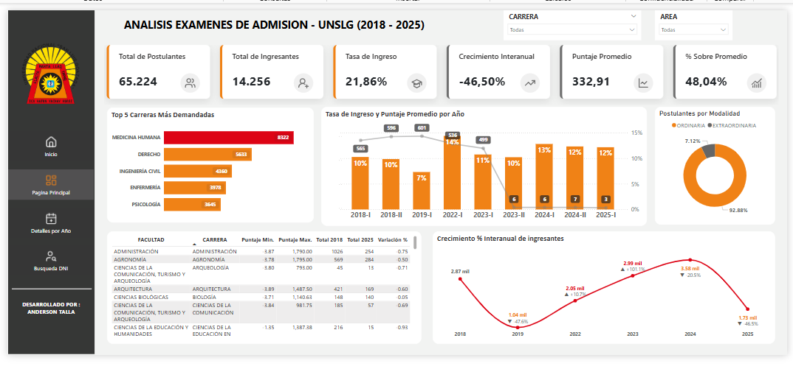

# Sistema de Análisis de Admisión UNICA

Sistema integral de ETL (Extract, Transform, Load) y análisis de datos para procesar y visualizar información histórica de exámenes de admisión universitaria (2018-2025).

## Descripción

Este proyecto automatiza el proceso de extracción, limpieza, normalización y migración de datos de admisión universitaria desde archivos Excel hacia una base de datos SQL Server. Incluye un dashboard interactivo en Power BI para análisis y visualización de tendencias históricas.

### Características Principales

- **Pipeline ETL Automatizado**: Procesamiento masivo de archivos Excel con limpieza y normalización de datos
- **Normalización Inteligente**: Mapeo automático de carreras, modalidades y sedes según bases oficiales
- **Migración a SQL Server**: Carga directa a base de datos relacional con manejo de errores
- **Dashboard Interactivo**: Visualización en Power BI con métricas clave y análisis temporal
- **Sistema Complementario**: Extractor web para generar archivos de entrada ([Ver sistema](https://extractor-unica.streamlit.app/))
- **Documentación Detallada**: Jupyter Notebook con análisis exploratorio completo

## Tecnologías Utilizadas

- **Python 3.8+**: Lenguaje principal
- **Pandas-Polars**: Manipulación y análisis de datos
- **SQLAlchemy**: Conexión y migración a SQL Server
- **Power BI**: Visualización y dashboarding
- **Jupyter Notebook**: Análisis y documentación
- **SQL Server**: Base de datos relacional

## Estructura del Proyecto

```
proyecto-unica-admision/
│
├── Bases/
│   └── bases.pdf              # Bases oficiales del examen de admisión
|
|── docs/
|   └── MEDIDAS_DAX.md         # Documentación de medidas DAX usadas en el dashboard
│
├── images/                    # Recursos visuales
│   ├── svgs/                  # Iconos SVG
│   └── screenshots/           # Capturas del dashboard
│       ├── AnalisisAño.png
│       ├── Busqueda.png
│       └── Home.png
│
├── input/                     # Archivos Excel por año (2018-2025)
│   ├── Resultados-UNICA-2016-II.xlsx.xlsx
│   ├── Resultados-UNICA-2022.xlsx.xlsx
│   └── ...
│
├── resultados/
│   └── Unido.xlsx            # Archivo consolidado generado
│
├── utils/
│   ├── connection_sql.py     # Orquestador de migración SQL
│   ├── mapeo.py              # Diccionarios de normalización
│   └── pipeline.py           # Pipeline ETL principal
│
├── analisis.ipynb            # Análisis exploratorio detallado
├── main.py                   # Script principal de ejecución
├── requirements.txt          # Dependencias del proyecto
└── README.md                 
```

## Instalación

### Prerrequisitos

- Python 3.8 o superior
- SQL Server
- SqlAlchemy
- Power BI Desktop (para el dashboard)

### Pasos de Instalación

1. **Clonar el repositorio**
```bash
git clone https://github.com/tu-usuario/proyecto-unica-admision.git
cd proyecto-unica-admision
```

2. **Crear entorno virtual (recomendado)**
```bash
python -m venv venv

# Windows
venv\Scripts\activate

# Linux/Mac
source venv/bin/activate
```

3. **Instalar dependencias**
```bash
pip install -r requirements.txt
```

4. **Configurar SQL Server**

Crear la base de datos en tu servidor SQL:
```sql
CREATE DATABASE BD_Unica;
```

O modificar la configuración en `main.py`:
```python
CreateModel.ejecutar_migracion(
    excel_path, 
    'tu_servidor',      # Cambiar servidor
    'tu_base_datos',    # Cambiar nombre BD
    'ODBC Driver 17 for SQL Server'
)
```

## Uso

### Generación de Archivos de Entrada

Puedes utilizar el **Sistema Extractor Web** para generar los archivos Excel de entrada:

[Extractor UNICA - Sistema Web](https://extractor-unica.streamlit.app/)

Este sistema permite:
- Extraer datos originales desde fuentes oficiales
- Generar archivos Excel limpios para futuros analisis
- Comparar versiones limpias vs. originales

### Ejecución del Pipeline


**Ejecutar el pipeline completo**:
```bash
python main.py
```

El script realizará automáticamente:
- Lectura de archivos Excel (2018-2025)
- Limpieza y normalización de datos
- Consolidación en archivo único
- Migración a SQL Server
- Generación de reporte en `resultados/`

### Visualización en Power BI

1. Abrir `UNICA_ADMISION.pbix`
2. Verificar conexión a la base de datos `BD_Unica`
3. Actualizar datos si es necesario
4. Explorar visualizaciones y métricas

## Capturas del Dashboard

Las capturas de pantalla del dashboard se encuentran en la carpeta `images/screenshots/`:

### Vista General


### Tendencias Anuales


### Analisis por Año y Carrera


### Busqueda por DNI


## Documentación Técnica

### Medidas DAX
El archivo Power BI incluye medidas personalizadas documentadas en detalle:

[Documentación de Medidas DAX](docs/MEDIDAS_DAX.md)

Incluye:
- Medidas base (Total Postulantes, Ingresantes, Ausentes)
- Indicadores de rendimiento (Tasa de Ingreso, Puntajes)
- Análisis por carrera (Rankings, Selectividad)
- Análisis temporal (Crecimientos, Variaciones)
- Utilidades de interfaz (Títulos dinámicos, Filtros)

##  Análisis Exploratorio

El archivo `analisis.ipynb` contiene:
- Análisis estadístico descriptivo
- Detección y tratamiento de valores atípicos
- Visualizaciones preliminares
- Documentación del proceso de limpieza
- Observaciones y decisiones técnicas

## Configuración Avanzada

### Modificar Normalización de Datos

Editar `utils/mapeo.py` para ajustar diccionarios de mapeo:
```python
dict_carrera = {
    'Nombre_Antiguo': 'Nombre_Normalizado',
    # ...
}
```

### Ajustar Rango de Años

En `main.py`, modificar el rango:
```python
df_final = FileETL.run_pipeline(
    './input/*.xlsx', 
    list(range(2018, 2026))  # Ajustar años
)
```

## Autor
- GitHub: [Ander-R903](https://github.com/Ander-R903)
- Email: lramostalla54@gmail.com

---

Si este proyecto te fue útil, considera darle una estrella en GitHub